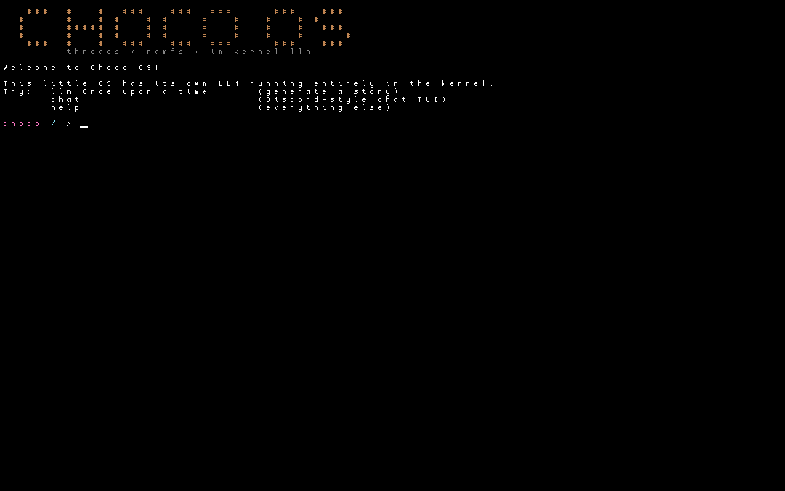
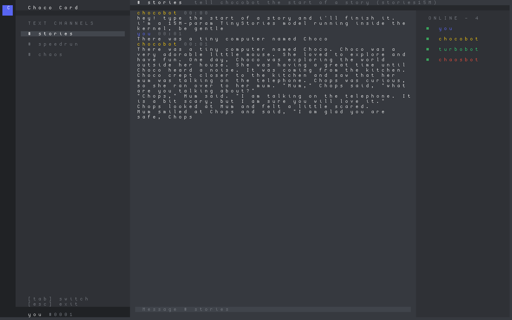
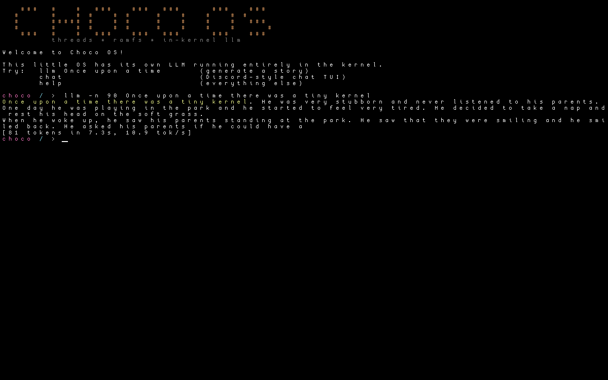
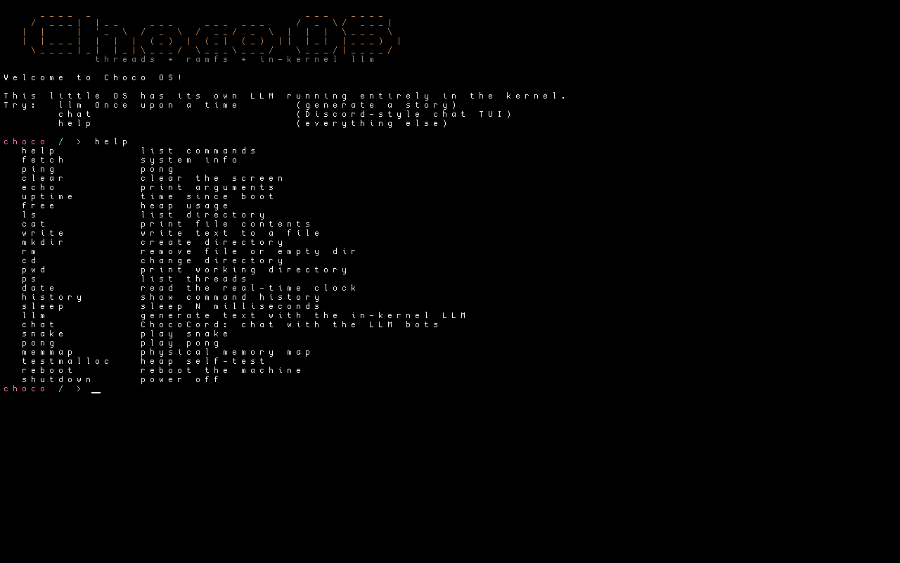

# Choco OS

A 64-bit hobby operating system that runs a **large language model inside the kernel** — and has a Discord-style chat TUI to talk to it. Also plays snake.



## What's inside

- **In-kernel LLM inference** — a freestanding port of [llama2.c](https://github.com/karpathy/llama2.c): full Llama-2 architecture forward pass (RoPE, grouped-query attention, SwiGLU), sentencepiece-style BPE tokenizer, temperature/top-p sampling, and a tiny hand-rolled float math library (`expf`/`logf`/`powf`/`sinf`/`cosf` + `sqrtss`). Model weights are read zero-copy out of bootloader module memory. Ships with TinyStories models:
  - `stories15M` — better prose, ~10 tok/s under QEMU emulation
  - `stories260K` — instant (~300+ tok/s)
- **A real instruct model in the kernel** — `qwen3` runs Qwen3-0.6B (int8-quantized, ported from [qwen3.c](https://github.com/adriancable/qwen3.c)): byte-level BPE with special tokens, QK-RMSNorm, half-split RoPE, Q8_0 quantized matmuls, and the chat template rendered in-kernel. `llm -m qwen3 What is a mutex?` gets you an actual answer — slowly, but from ring 0.
- **ChocoCord** — a Discord-style chat TUI (`chat`) where the channel bots are LLM personas. Replies generate on a background kernel thread and stream into the message live.

  

- **Preemptive multitasking** — round-robin kernel threads with per-thread FPU/SSE state, timer-driven preemption + voluntary yield via software interrupt.
- **A network stack** — PCI enumeration, polled e1000 driver, ARP/IPv4/ICMP/UDP, a DHCP client and DNS resolver. `ifconfig`, `ping`, `nslookup`:

  ```
  choco / > ping 10.0.2.2
  64 bytes from 10.0.2.2: icmp_seq=1 time=10 ms
  choco / > nslookup example.com
  example.com -> 104.20.23.154
  ```
- **RAM filesystem** — mounted from a ustar initrd at boot; `ls`, `cat`, `write`, `mkdir`, `rm`, `cd`, `pwd`.
- **Kernel heap** — PMM-backed, claims up to 768 MiB, handles the multi-MB allocations the LLM needs.
- **Real drivers** — full PS/2 scancode-set-2 keyboard (shift/caps/ctrl, arrows, history navigation), 1000 Hz PIT, CMOS RTC, COM1 serial console (everything the terminal prints is mirrored to serial).
- **A shell** — argument parsing, command history, line editing, ctrl+c/ctrl+l, and a `help` command that tells the truth.
- **Games** — snake and pong, as is tradition.

## LLM in the shell

```
choco / > llm Once upon a time
Once upon a time, there was a little girl named Lily...
[391 tokens in 1.1s, 332.7 tok/s]

choco / > llm -m stories260K -t 140 -n 100 The robot said
choco / > llm -m qwen3 Explain virtual memory in one sentence.
choco / > llm -i              # model info
```



## How to run

Mac (Apple Silicon or Intel):

```sh
brew install x86_64-elf-gcc nasm qemu xorriso
gmake run
```

The first build downloads the TinyStories model weights (~60 MB) and the Qwen3-0.6B snapshot (~1.4 GB, quantized to a ~635 MB Q8_0 checkpoint by `tools/export_qwen3.py`, which needs [uv](https://docs.astral.sh/uv/)) from HuggingFace into `models/`. Windows/Linux: adjust the compiler/linker in `kernel/GNUmakefile` and use any cross x86_64-elf toolchain.

## Architecture notes

- Boots via [Limine](https://github.com/limine-bootloader/limine); kernel + initrd + model weights are Limine modules on the ISO.
- The kernel is compiled soft-float (`-mno-sse`) so interrupt handlers never touch FP state; only the LLM engine files (`llm.c`, `qwen.c`, `llm_common.c`, `llm_math.c`) are built hard-float with SSE. No float crosses the API boundary (temperatures are passed in centi-units), and the context switcher `fxsave`s per thread.
- A thread's saved context is literally the interrupt frame on its own stack; the timer ISR hands its stack pointer to the scheduler, which hands back the next thread's.
- `tools/qemu_driver.py` drives the OS headlessly over the QEMU monitor (sendkey/screendump); `tools/smoke_test.py` runs an end-to-end test suite that boots the ISO and asserts on serial output.

## Testing

```sh
gmake                                  # build template.iso
python3 tools/smoke_test.py            # boot + ~20 end-to-end checks
```

## Screenshots

| Shell | Snake |
| --- | --- |
|  |  |
